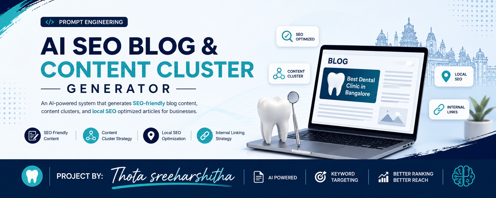

# Future Interns - Prompt Engineering Task 3

# AI SEO Blog & Content Cluster Generator

## Project By
**Thota Sreeharshitha**

## Introduction
This project demonstrates how prompt engineering can be used to generate SEO-friendly content for a local business. A dental clinic business in Bangalore was chosen to create a pillar blog, supporting blogs, keyword strategy, search intent analysis, local SEO content, and internal linking recommendations.

## Business Selected
- Business: Clove Dental
- Location: Bangalore
- Industry: Dental Healthcare

## Objectives
- Generate SEO blogs using prompts
- Create content clusters
- Apply keyword research
- Understand search intent
- Implement local SEO
- Use internal linking

## Keyword Research
### Primary Keyword
- Best Dental Clinic in Bangalore

### Secondary Keywords
- Dental Implant Cost in Bangalore
- Teeth Whitening Treatment Bangalore
- Emergency Dentist Bangalore
- Benefits of Regular Dental Checkups
- How to Choose a Dentist in Bangalore

## Search Intent Analysis
### Informational
- Teeth Whitening Treatment
- Benefits of Dental Checkups

### Commercial
- Best Dental Clinic in Bangalore
- Dental Implant Cost in Bangalore

### Transactional
- Emergency Dentist Bangalore

## Content Cluster Structure

### Pillar Blog
# Best Dental Clinic in Bangalore

### Supporting Blogs
1. Dental Implant Cost in Bangalore
2. Teeth Whitening Treatment – Benefits and Risks
3. How to Choose the Right Dentist in Bangalore
4. Benefits of Regular Dental Checkups
5. Emergency Dental Care in Bangalore

## SEO Heading Structure

# H1 Example
Best Dental Clinic in Bangalore

## H2 Example
Why Choosing the Right Dental Clinic Matters

### H3 Example
Benefits of Professional Dental Care

## Prompt Engineering Approach
The prompts include business information, keywords, search intent, H1-H3 structure, FAQ sections, local SEO keywords, and internal linking instructions.

## Local SEO Strategy
Location-based keywords are included naturally throughout the content:
- Dentist in Bangalore
- Best Dental Clinic in Bangalore
- Emergency Dentist Bangalore

## Internal Linking Strategy
All supporting blogs link back to the pillar blog to create a strong content cluster.

## Repository Structure
README.md
prompts.txt
keyword-research.txt
pillar-blog.md
supporting-blog-1.md
supporting-blog-2.md
supporting-blog-3.md
supporting-blog-4.md
supporting-blog-5.md
banner.png

## Learning Outcomes
- SEO basics
- Keyword research
- Search intent analysis
- Content clustering
- Prompt engineering
- Local SEO

## Conclusion
This project shows how prompt engineering can be combined with SEO practices to generate useful content for local businesses.
